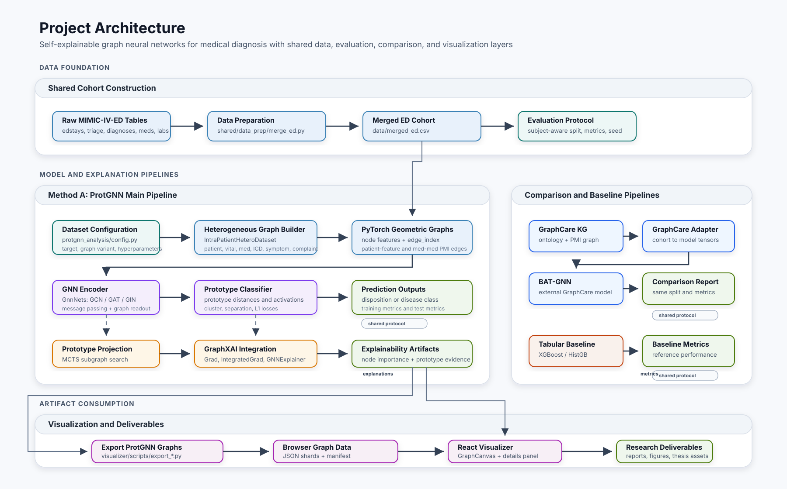

# Project Architecture Diagram

Recommended polished version:

Source diagram:

```mermaid
%%{init: {
  "theme": "base",
  "themeVariables": {
    "fontFamily": "Inter, ui-sans-serif, system-ui, sans-serif",
    "fontSize": "15px",
    "primaryTextColor": "#111827",
    "lineColor": "#334155",
    "clusterBkg": "#f8fafc",
    "clusterBorder": "#cbd5e1"
  }
}}%%
flowchart LR
    raw["MIMIC-IV-ED raw files<br/>edstays, triage, diagnosis, medrecon, labs"]
    prep["shared/data_prep<br/>merge_ed.py + standardizers"]
    merged["data/merged_ed.csv<br/>shared patient cohort"]

    shared["shared/lib<br/>subject-aware split<br/>metrics<br/>seed/config base"]

    raw --> prep --> merged
    merged --> shared

    subgraph prot["Method A: ProtGNN analysis"]
        direction TB
        cfgA["protgnn_analysis/config.py<br/>dataset/model/train settings"]
        dsA["load_dataset.py<br/>IntraPatientHeteroDataset"]
        graphA["PyG patient graph<br/>PATIENT, VITAL, MED, ICD,<br/>SYMPTOM, CHIEF_COMPLAINT nodes"]
        edgesA["Graph topology<br/>patient-feature edges<br/>med-med PMI edges"]
        modelA["models/GnnNets<br/>GCN / GAT / GIN backbone"]
        embA["node embeddings<br/>global graph readout"]
        protA["prototype layer<br/>prototype distances<br/>class-specific activations"]
        clsA["prediction<br/>disposition or disease class"]
        trainA["train.py<br/>training loop + early stop<br/>cluster/separation/L1 losses"]
        mctsA["my_mcts.py<br/>prototype projection<br/>interpretable subgraphs"]
        gxaiA["GraphXAI explainers<br/>Grad, IntegratedGrad,<br/>GNNExplainer"]
        explA["explanation artifacts<br/>node/feature importance<br/>prototype evidence"]
        outA["protgnn_analysis/outputs<br/>checkpoints, metrics,<br/>reports, explanations"]

        cfgA --> dsA
        dsA --> graphA
        graphA --> edgesA --> modelA
        modelA --> embA
        embA --> protA --> clsA
        trainA --> modelA
        trainA --> mctsA --> protA
        modelA --> gxaiA --> explA
        protA --> explA
        clsA --> outA
        explA --> outA
    end

    subgraph graphcare["Method B: GraphCare comparison"]
        direction TB
        kgB["build_kg.py<br/>global ontology + PMI KG"]
        adapterB["adapter.py<br/>merged_ed.csv to GraphCare tensors"]
        subB["per-patient KG subgraph<br/>patient codes + 1-hop neighbours"]
        modelB["external/GraphCare<br/>BAT-GNN model"]
        evalB["run.py<br/>train/evaluate with shared metrics"]
        outB["graphcare_analysis/outputs<br/>report + metrics"]

        kgB --> adapterB --> subB --> modelB --> evalB --> outB
    end

    subgraph baseline["Tabular baseline"]
        direction TB
        base["baselines/disease_baseline.py<br/>XGBoost / HistGradientBoosting"]
        baseOut["baseline metrics"]
        base --> baseOut
    end

    subgraph viz["Browser graph visualizer"]
        direction TB
        export["visualizer/scripts/export_protgnn_graphs.py<br/>PyG graphs to JSON shards"]
        json["visualizer/public/graphs<br/>manifest + graph shards"]
        app["visualizer React app<br/>App, GraphCanvas,<br/>NodeDetailsPanel, Legend"]
        ui["interactive patient graph UI"]

        export --> json --> app --> ui
    end

    merged --> dsA
    shared --> trainA
    merged --> kgB
    merged --> adapterB
    shared --> evalB
    merged --> base
    shared --> base
    dsA --> export
    outA --> export

    classDef source fill:#e8f1fb,stroke:#3b82b6,stroke-width:2px,color:#111827
    classDef sharedLayer fill:#edf7f6,stroke:#0f766e,stroke-width:2px,color:#111827
    classDef protData fill:#f8fafc,stroke:#64748b,stroke-width:2px,color:#111827
    classDef protModel fill:#f4eefc,stroke:#7c3aed,stroke-width:2px,color:#111827
    classDef explain fill:#fef6e7,stroke:#d97706,stroke-width:2px,color:#111827
    classDef output fill:#eff7ed,stroke:#4d7c0f,stroke-width:2px,color:#111827
    classDef graphcare fill:#eef6ff,stroke:#2563eb,stroke-width:2px,color:#111827
    classDef baseline fill:#f9f1ec,stroke:#c2410c,stroke-width:2px,color:#111827
    classDef visual fill:#f7eff6,stroke:#a21caf,stroke-width:2px,color:#111827

    class raw,prep,merged source
    class shared sharedLayer
    class cfgA,dsA,graphA,edgesA protData
    class modelA,embA,protA,clsA,trainA protModel
    class mctsA,gxaiA,explA explain
    class outA,outB,baseOut output
    class kgB,adapterB,subB,modelB,evalB graphcare
    class base baseline
    class export,json,app,ui visual

    style prot fill:#ffffff,stroke:#cbd5e1,stroke-width:2px,color:#111827
    style graphcare fill:#ffffff,stroke:#cbd5e1,stroke-width:2px,color:#111827
    style baseline fill:#ffffff,stroke:#cbd5e1,stroke-width:2px,color:#111827
    style viz fill:#ffffff,stroke:#cbd5e1,stroke-width:2px,color:#111827
```

## Short Reading

The repository has one shared data/evaluation spine and three model-facing branches.

- `shared/data_prep` turns raw MIMIC-IV-ED tables into `data/merged_ed.csv`.
- `shared/lib` keeps split and metric logic consistent across experiments.
- `protgnn_analysis` is the main method: it builds one heterogeneous graph per ED visit, trains a PyTorch Geometric GNN, and optionally classifies through learned prototypes.
- Prototype explanations come from two places: MCTS projection finds prototype-like subgraphs, while GraphXAI produces node/feature-importance explanations.
- `graphcare_analysis` adapts the same cohort into GraphCare's KG-augmented BAT-GNN format for comparison.
- `baselines` gives a tabular reference point.
- `visualizer` exports ProtGNN graphs as browser-readable JSON and renders them in a React interface.
